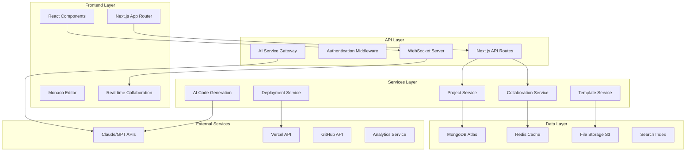

# Design Document

## Overview

This design document outlines the architecture and implementation strategy for transforming Kodex into a world-class web development platform. The design focuses on scalability, performance, user experience, and competitive differentiation while maintaining the existing codebase where possible.

## Architecture

### High-Level Architecture



### Core Components Architecture

#### 1. Enhanced IDE Core
- **Monaco Editor Integration**: Advanced configuration with custom language services
- **File System Abstraction**: Virtual file system with real-time synchronization
- **Plugin Architecture**: Extensible system for custom functionality
- **Theme System**: Customizable UI themes and editor configurations

#### 2. AI Code Generation Engine
- **Multi-Provider Support**: Claude, GPT-4, and local models
- **Context Management**: Intelligent context building from project files
- **Code Analysis**: AST parsing for better code understanding
- **Template Engine**: Smart template generation and customization

#### 3. Real-time Collaboration System
- **Operational Transformation**: Conflict-free collaborative editing
- **Presence Management**: User cursors, selections, and activity
- **Communication Layer**: Integrated chat and commenting
- **Permission System**: Granular access control

#### 4. Project Management System
- **Workspace Organization**: Multi-project management
- **Version Control**: Git-like versioning with branching
- **Template Library**: Curated and community templates
- **Asset Management**: File uploads and media handling

## Components and Interfaces

### 1. Enhanced IDE Interface

```typescript
interface IDEState {
  workspace: Workspace
  activeProject: Project | null
  openFiles: EditorFile[]
  activeFile: EditorFile | null
  collaborators: Collaborator[]
  aiAssistant: AIAssistantState
  preview: PreviewState
  deployment: DeploymentState
}

interface Workspace {
  id: string
  name: string
  projects: Project[]
  settings: WorkspaceSettings
  members: WorkspaceMember[]
}

interface Project {
  id: string
  name: string
  description: string
  framework: Framework
  template: Template
  files: ProjectFile[]
  dependencies: Dependency[]
  environment: Environment[]
  deployments: Deployment[]
  collaborators: Collaborator[]
  settings: ProjectSettings
}
```

### 2. AI Code Generation Interface

```typescript
interface AICodeGenerator {
  generateCode(request: CodeGenerationRequest): Promise<CodeGenerationResult>
  analyzeCode(code: string, language: string): Promise<CodeAnalysis>
  suggestImprovements(file: ProjectFile): Promise<Suggestion[]>
  explainCode(code: string): Promise<CodeExplanation>
}

interface CodeGenerationRequest {
  prompt: string
  type: 'component' | 'page' | 'feature' | 'api' | 'test' | 'full-app'
  context: ProjectContext
  constraints: GenerationConstraints
  preferences: UserPreferences
}

interface CodeGenerationResult {
  files: GeneratedFile[]
  explanation: string
  suggestions: string[]
  dependencies: Dependency[]
  tests: TestFile[]
}
```

### 3. Collaboration Interface

```typescript
interface CollaborationEngine {
  joinProject(projectId: string, user: User): Promise<CollaborationSession>
  leaveProject(sessionId: string): Promise<void>
  broadcastOperation(operation: Operation): Promise<void>
  handleOperation(operation: Operation): Promise<void>
  getCursors(): Cursor[]
  getPresence(): PresenceInfo[]
}

interface Operation {
  type: 'insert' | 'delete' | 'retain'
  position: number
  content?: string
  length?: number
  author: string
  timestamp: number
}

interface Cursor {
  userId: string
  position: EditorPosition
  selection?: EditorRange
  color: string
}
```

### 4. Deployment Interface

```typescript
interface DeploymentManager {
  deploy(project: Project, config: DeploymentConfig): Promise<Deployment>
  getDeployments(projectId: string): Promise<Deployment[]>
  rollback(deploymentId: string): Promise<void>
  getDeploymentLogs(deploymentId: string): Promise<DeploymentLog[]>
  updateEnvironment(deploymentId: string, env: Environment[]): Promise<void>
}

interface DeploymentConfig {
  provider: 'vercel' | 'netlify' | 'aws' | 'custom'
  environment: 'development' | 'staging' | 'production'
  buildCommand?: string
  outputDirectory?: string
  environmentVariables: Record<string, string>
  domains?: string[]
}
```

## Data Models

### Core Data Models

```typescript
// User and Authentication
interface User {
  id: string
  email: string
  name: string
  avatar?: string
  plan: 'free' | 'pro' | 'enterprise'
  preferences: UserPreferences
  createdAt: Date
  lastActiveAt: Date
}

// Project Structure
interface ProjectFile {
  id: string
  name: string
  path: string
  content: string
  language: string
  size: number
  lastModified: Date
  lastModifiedBy: string
  version: number
}

// Template System
interface Template {
  id: string
  name: string
  description: string
  category: string
  framework: Framework
  files: TemplateFile[]
  dependencies: Dependency[]
  configuration: TemplateConfig
  preview: string
  tags: string[]
  downloads: number
  rating: number
}

// Collaboration
interface CollaborationSession {
  id: string
  projectId: string
  participants: Participant[]
  operations: Operation[]
  cursors: Map<string, Cursor>
  comments: Comment[]
  createdAt: Date
}
```

### Database Schema Design

```typescript
// MongoDB Collections
const schemas = {
  users: {
    _id: ObjectId,
    email: String,
    name: String,
    passwordHash: String,
    plan: String,
    preferences: Object,
    createdAt: Date,
    updatedAt: Date
  },
  
  projects: {
    _id: ObjectId,
    name: String,
    description: String,
    ownerId: ObjectId,
    framework: String,
    template: String,
    files: [FileSchema],
    collaborators: [CollaboratorSchema],
    deployments: [DeploymentSchema],
    settings: Object,
    createdAt: Date,
    updatedAt: Date
  },
  
  templates: {
    _id: ObjectId,
    name: String,
    description: String,
    category: String,
    framework: String,
    files: [TemplateFileSchema],
    configuration: Object,
    authorId: ObjectId,
    isPublic: Boolean,
    downloads: Number,
    rating: Number,
    createdAt: Date
  }
}
```

## Error Handling

### Error Classification and Handling Strategy

```typescript
enum ErrorType {
  VALIDATION_ERROR = 'VALIDATION_ERROR',
  AUTHENTICATION_ERROR = 'AUTHENTICATION_ERROR',
  AUTHORIZATION_ERROR = 'AUTHORIZATION_ERROR',
  RESOURCE_NOT_FOUND = 'RESOURCE_NOT_FOUND',
  RATE_LIMIT_EXCEEDED = 'RATE_LIMIT_EXCEEDED',
  AI_SERVICE_ERROR = 'AI_SERVICE_ERROR',
  DEPLOYMENT_ERROR = 'DEPLOYMENT_ERROR',
  COLLABORATION_ERROR = 'COLLABORATION_ERROR',
  SYSTEM_ERROR = 'SYSTEM_ERROR'
}

interface ErrorResponse {
  type: ErrorType
  message: string
  details?: any
  code: string
  timestamp: Date
  requestId: string
}

class ErrorHandler {
  static handle(error: Error, context: RequestContext): ErrorResponse
  static logError(error: Error, context: RequestContext): void
  static notifyUser(error: ErrorResponse): void
  static shouldRetry(error: ErrorResponse): boolean
}
```

### Graceful Degradation Strategy

1. **AI Service Failures**: Fallback to template-based generation
2. **Collaboration Failures**: Switch to local editing with sync retry
3. **Deployment Failures**: Provide detailed logs and rollback options
4. **Network Issues**: Offline mode with local storage and sync queue

## Testing Strategy

### Testing Pyramid

```typescript
// Unit Tests (70%)
interface UnitTestSuite {
  components: ComponentTests
  utilities: UtilityTests
  services: ServiceTests
  hooks: HookTests
}

// Integration Tests (20%)
interface IntegrationTestSuite {
  apiEndpoints: APITests
  databaseOperations: DatabaseTests
  externalServices: ExternalServiceTests
  collaborationFlow: CollaborationTests
}

// End-to-End Tests (10%)
interface E2ETestSuite {
  userJourneys: UserJourneyTests
  crossBrowser: CrossBrowserTests
  performance: PerformanceTests
  accessibility: AccessibilityTests
}
```

### Testing Tools and Framework

- **Unit Testing**: Jest + React Testing Library
- **Integration Testing**: Supertest + MongoDB Memory Server
- **E2E Testing**: Playwright
- **Visual Regression**: Chromatic
- **Performance Testing**: Lighthouse CI
- **Accessibility Testing**: axe-core

### Continuous Testing Strategy

```typescript
interface TestingPipeline {
  preCommit: {
    linting: ESLint
    typeChecking: TypeScript
    unitTests: Jest
    formatting: Prettier
  }
  
  pullRequest: {
    unitTests: Jest
    integrationTests: Supertest
    visualRegression: Chromatic
    accessibility: axe
  }
  
  deployment: {
    e2eTests: Playwright
    performanceTests: Lighthouse
    securityTests: OWASP
    loadTests: Artillery
  }
}
```

## Performance Optimization

### Frontend Performance

1. **Code Splitting**: Route-based and component-based splitting
2. **Lazy Loading**: Virtual scrolling for large file lists
3. **Caching Strategy**: Service worker for offline capabilities
4. **Bundle Optimization**: Tree shaking and dead code elimination

### Backend Performance

1. **Database Optimization**: Indexing strategy and query optimization
2. **Caching Layer**: Redis for session and frequently accessed data
3. **API Optimization**: GraphQL for efficient data fetching
4. **CDN Integration**: Static asset delivery optimization

### Real-time Performance

1. **WebSocket Optimization**: Connection pooling and message batching
2. **Operational Transform**: Efficient conflict resolution algorithms
3. **Presence Optimization**: Throttled presence updates
4. **Memory Management**: Garbage collection for long-running sessions

## Security Architecture

### Authentication and Authorization

```typescript
interface SecurityLayer {
  authentication: {
    providers: ['credentials', 'oauth', 'sso']
    mfa: boolean
    sessionManagement: JWTStrategy
  }
  
  authorization: {
    rbac: RoleBasedAccessControl
    permissions: PermissionMatrix
    resourceAccess: ResourceAccessControl
  }
  
  dataProtection: {
    encryption: 'AES-256'
    hashing: 'bcrypt'
    sanitization: InputSanitizer
  }
}
```

### Security Measures

1. **Input Validation**: Comprehensive validation for all user inputs
2. **SQL Injection Prevention**: Parameterized queries and ORM usage
3. **XSS Protection**: Content Security Policy and input sanitization
4. **CSRF Protection**: Token-based CSRF protection
5. **Rate Limiting**: API rate limiting and DDoS protection
6. **Audit Logging**: Comprehensive activity logging

## Scalability Design

### Horizontal Scaling Strategy

```typescript
interface ScalingArchitecture {
  loadBalancing: {
    type: 'round-robin' | 'least-connections'
    healthChecks: boolean
    stickySessions: boolean
  }
  
  microservices: {
    aiService: AIServiceConfig
    collaborationService: CollaborationServiceConfig
    deploymentService: DeploymentServiceConfig
    fileService: FileServiceConfig
  }
  
  database: {
    sharding: ShardingStrategy
    replication: ReplicationConfig
    caching: CachingStrategy
  }
}
```

### Performance Monitoring

1. **Application Monitoring**: Real-time performance metrics
2. **Error Tracking**: Comprehensive error logging and alerting
3. **User Analytics**: Usage patterns and performance insights
4. **Infrastructure Monitoring**: Server and database performance

## Integration Points

### External Service Integration

```typescript
interface ExternalIntegrations {
  aiProviders: {
    claude: AnthropicConfig
    openai: OpenAIConfig
    local: LocalModelConfig
  }
  
  deploymentProviders: {
    vercel: VercelConfig
    netlify: NetlifyConfig
    aws: AWSConfig
  }
  
  versionControl: {
    github: GitHubConfig
    gitlab: GitLabConfig
  }
  
  designTools: {
    figma: FigmaConfig
    sketch: SketchConfig
  }
}
```

### API Design

1. **RESTful APIs**: Standard REST endpoints for CRUD operations
2. **GraphQL**: Efficient data fetching for complex queries
3. **WebSocket APIs**: Real-time communication protocols
4. **Webhook Support**: Event-driven integrations

This design provides a comprehensive foundation for building a competitive web development platform that can scale to serve thousands of users while maintaining excellent performance and user experience.